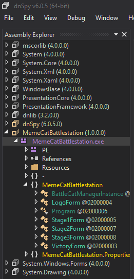
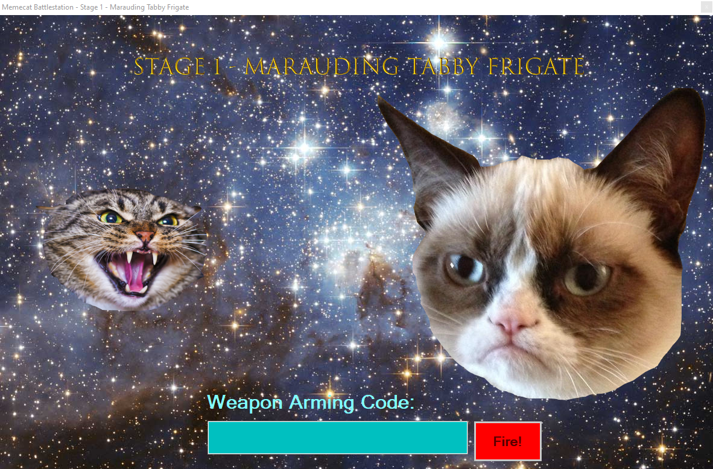
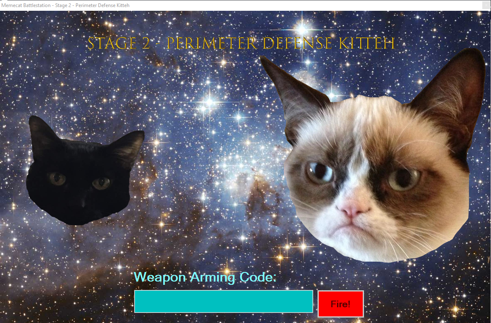
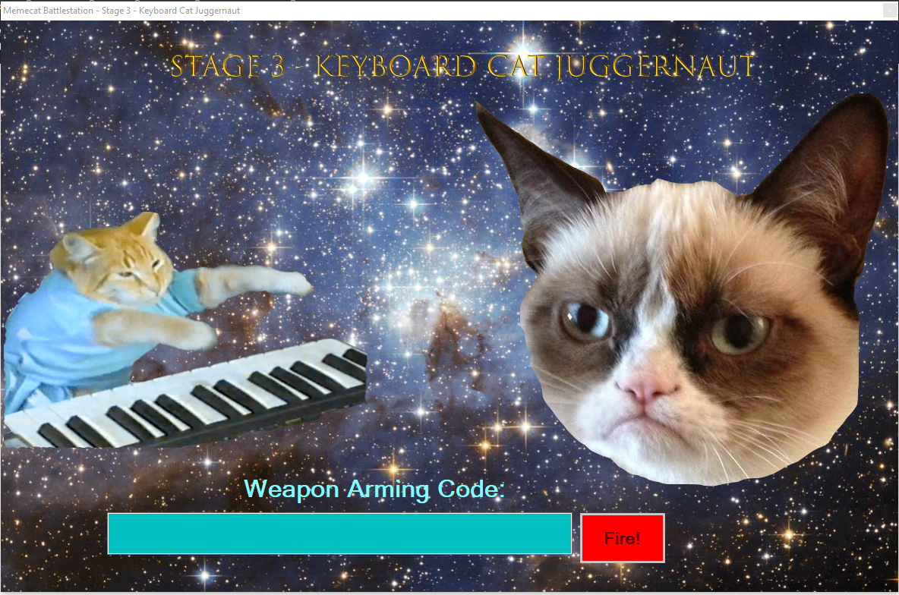
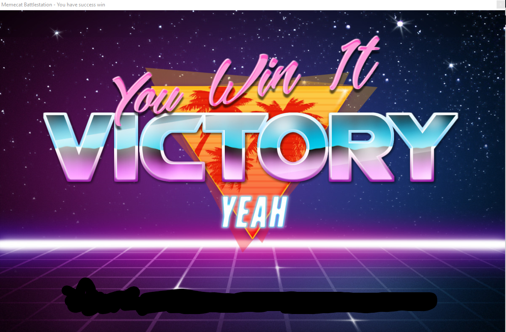

# Memecat Battlestation

## Challenge

From this [Tweet](https://twitter.com/nickharbour/status/1161253276538376194):
> \#flareon6 Solve the full version of Memecat Battlestation and bypass the first level of this
> year's flare-on challenge, which is the demo version of this awesome game.
> http://flare-on.com/BHUSA2019.zip password "BHUSA2019"


## Write-up
When unzipping the `BHUSA2019.zip` you find a `MemeCatBattlestation.exe` and a `readme.txt` files.

The readme says:

> Welcome to FireEye's special FLARE-On 2019 Level!
> Solve the level and give the flag to the FLARE person at the booth for a sticker.
> 
> FLARE-On 6 starts 2019-08-17 00:00 UTC
> Enjoy!

Opening it in [Die](https://github.com/horsicq/Detect-It-Easy) we see this is a Dotnet exe,
so [DnSpy](https://github.com/0xd4d/dnSpy) is your tool of choice:



We are presented with 4 forms, Stage1 to Stage3 and VictoryForm.

### Stage 1

Opening Stage1 we can see a `fireButton` which probably is associated with some event/action:
`this.fireButton.Click += this.FireButton_Click;`. So let's have a look at FireButton_Click.

```C#
// Token: 0x06000011 RID: 17 RVA: 0x00002580 File Offset: 0x00000780
private void FireButton_Click(object sender, EventArgs e)
{
    if (this.codeTextBox.Text == "RAINBOW")
    {
        this.fireButton.Visible = false;
        this.codeTextBox.Visible = false;
        this.armingCodeLabel.Visible = false;
        this.invalidWeaponLabel.Visible = false;
        this.WeaponCode = this.codeTextBox.Text;
        this.victoryAnimationTimer.Start();
        return;
    }
    this.invalidWeaponLabel.Visible = true;
    this.codeTextBox.Text = "";
}
```

There we can see that some input is compared to the string `"RAINBOW"`. Let's execute the exe and use this as
an INPUT:



The weapon code is `"RAINBOW"`! Stage 1 complete, off to stage 2.

### Stage 2



In the `Stage2Form` we can see a variable: `public string WeaponCode;`. Let's see where it goes...

By searching the variable name, we stumble upon the following function:

```C#
// Token: 0x0600001A RID: 26 RVA: 0x00003190 File Offset: 0x00001390
private bool isValidWeaponCode(string s)
{
    char[] array = s.ToCharArray();
    int length = s.Length;
    for (int i = 0; i < length; i++)
    {
        char[] array2 = array;
        int num = i;
        array2[num] ^= (char)(65 + i * 2);
    }
    return array.SequenceEqual(new char[]
    {
        '\u0003',
        '"',
        '"',
        '"',
        '%',
        '\u0014',
        '\u000e',
        '.',
        '?',
        '=',
        ':',
        '9'
    });
}
```

We can clearly see what's going on here. There's a comparison between the input and an array after some
XORing of the character.

Using this python code snippet [stage2.py]('./stage2.py') we can get the second launch code: "Bagel_Cannon".

Off to stage 3!!!

### Stage 3



Using same strategy, while opening the 3rd form and following execution path from the `FireButton_Click`
we find an `isValidWeaponCode` that takes a string as input and perform some transformations on it and
compare the result to an array of bytes:

```C#
// Token: 0x06000025 RID: 37 RVA: 0x00003C98 File Offset: 0x00001E98
private bool isValidWeaponCode(string s)
{
    string catGenetics = this.getCatGenetics();
    return BattleCatManagerInstance.InitializeBattleCat(Encoding.UTF8.GetBytes(catGenetics), Encoding.UTF8.GetBytes(s)).SequenceEqual(new byte[]
    {
        95,
        193,
        50,
        12,
        127,
        228,
        98,
        6,
        215,
        46,
        200,
        106,
        251,
        121,
        186,
        119,
        109,
        73,
        35,
        14,
        20
    });
}
```

Reimplementing these different function in [stage3.py]('./stage3.py') we are able to find the third launch
code: "Defeat_them_with_love"!

## VICTORY



The final flag is: "Kitteh_save_galixy@flare-on.com"
