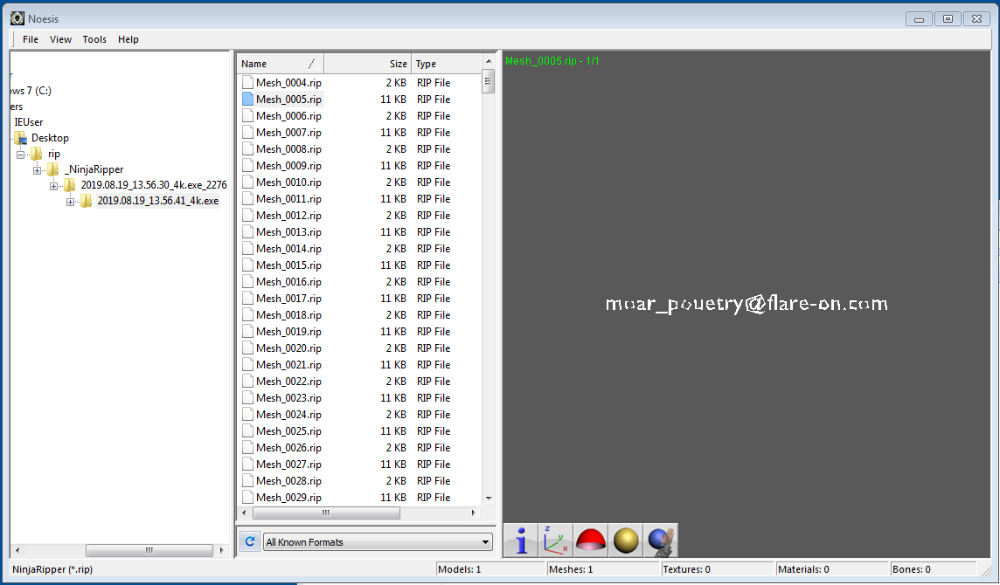

# demo

## Message.txt

> Someone on the Flare team tried to impress us with their demoscene skills. It seems
> blank. See if you can figure it out or maybe we will have to fire them. No pressure.
>
>    7Zip password: flare ** You will need DirectX 9

## Reversing?

Exe is packed, as expected for a demo scene binary. Tried to debug in Windbg but I did not
see anything shady going on.

## Extracting 3d models

After fighting with different setups, here's what worked:

- Win7 32b vm from [modern.ie](https://developer.microsoft.com/en-us/microsoft-edge/tools/vms/) in VBox + Direct3d extension
- directx 9.0c web [installer](tools/dxwebsetup.exe)
- [NinjaRipper](tools/ninjaripper171.7z) to extract models
- [Noesis](tools/noesisv4406.zip) + Ninjaripper plugin to view the models.

## Solution

Flag: moar_pouetry@flare-on.com

## Epilogue

After finding the texture, maybe there's a way to display it while debugging the
application...

## Links

[deviantart](https://www.deviantart.com/xcurtainx/journal/Rip-Your-Favorite-3D-Game-Character-Models-FREE-753410159)
